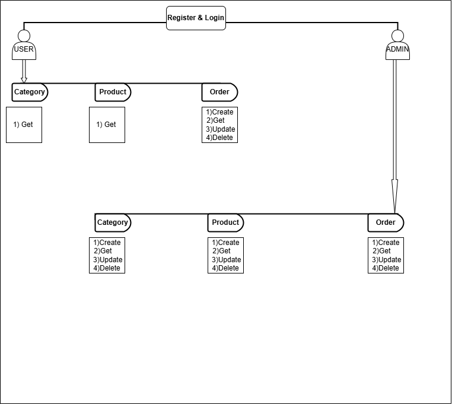
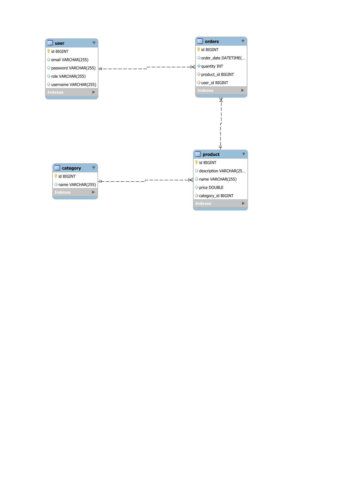
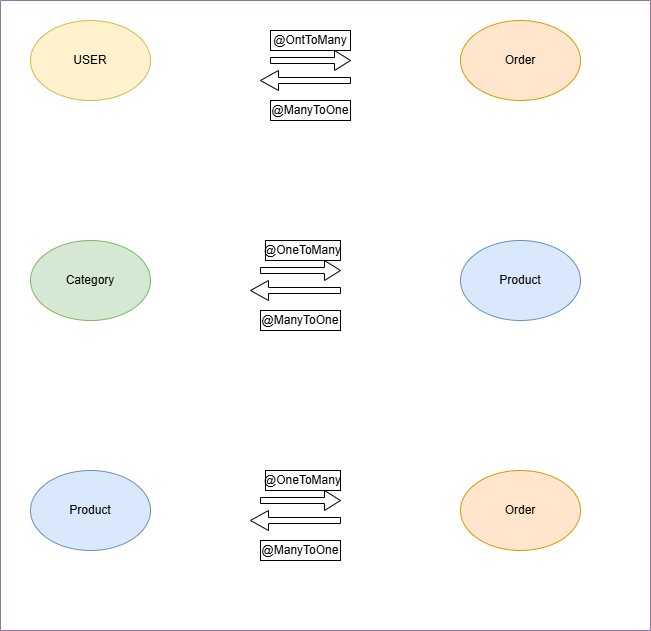

# EcomGlobe

## Overview
## EcomGlobe is Spring Boot base Ecommerce platform where user can browse product, place order and manage categories and JWT Authentication for security .

##Features
-User Registration and Login with JWT Authentication.
-Role-Based Access Control (Admin & User roles).
-CRUD Operation for Categories,Product and Order.
-Secure API endpoints with Spring security.

## Technologies Used
- Java 17
- Spring Boot
- Spring Security (JWT Authentication)
- Hibernate (JPA)
- MySQL Database
- Gradle

## Flow Diagram

## ER Diagram

## Entity Relation Mapping

# Entity Relationships
-User & Order: One-To-Many
-Order & Product: Many-To-One
-Product & Category: Many-To-One

#API Endpoints

Authentication:
-POST/auth/register
-POST/auth/login

Categories:
-POST/category/create
-GET/category/get
-PUT/category/{id}
-DELETE/category/{id}

Products:
-POST/product/create
-GET/product/get
-PUT/product/update/{id}
-DELETE/product/{id}

Orders:
-POST/order/create
-GET/order/get
-PUT/order/update/{id}
-DELETE/order/delete/{id}

# Access API via PostMan
